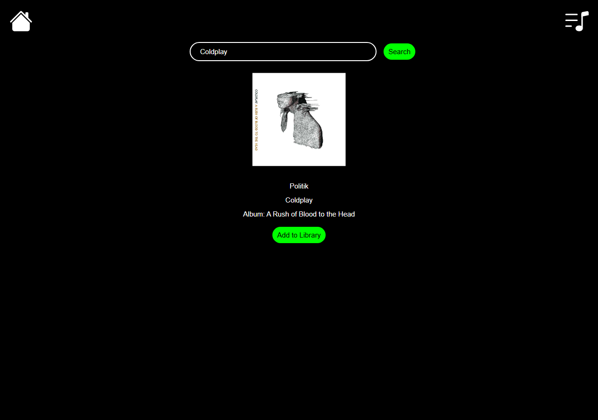
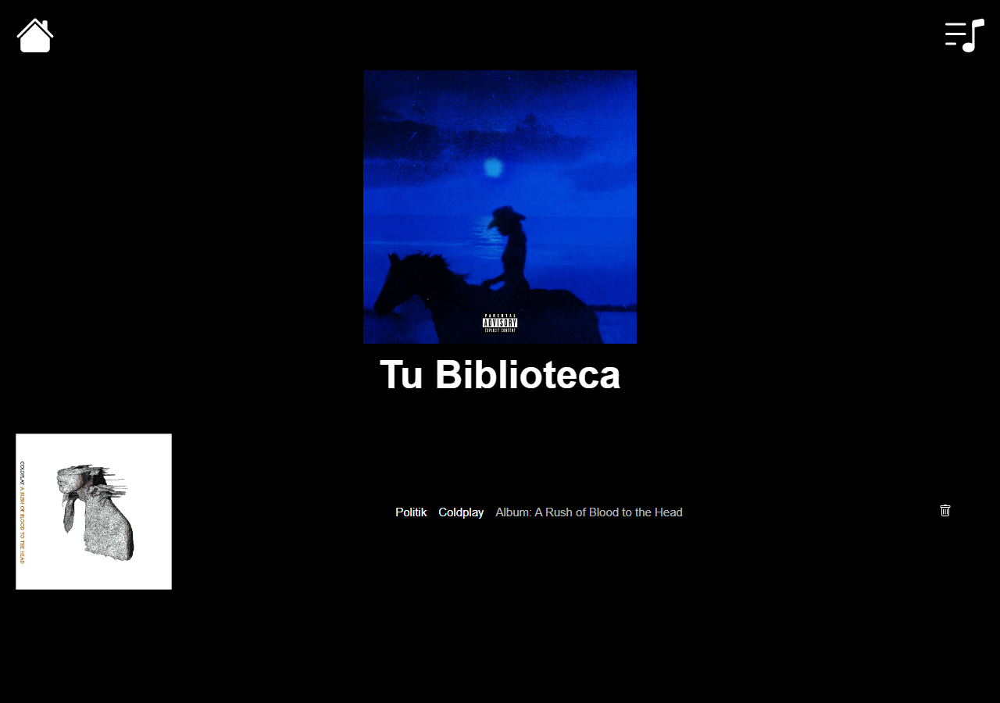

# Biblioteca de música


Aplicación de una sola página (SPA) construida con **React** y **TypeScript** que permite buscar canciones por artista usando la API pública de **TheAudioDB**, agregarlas a una biblioteca personal y ver el detalle de cada canción. Es la segunda versión del proyecto [Biblioteca-musical](https://github.com/Donaldo500/Biblioteca-musical).

## Capturas de pantalla

| Búsqueda por artista | Tu biblioteca |
| --- | --- |
|  |  |

## Funcionalidades

- **Búsqueda por artista**: consulta los álbumes del artista y, en paralelo con `Promise.all`, obtiene las canciones de cada álbum.
- **Agregar a la biblioteca**: cada resultado muestra el botón *Add to Library* o la etiqueta *In Library* si ya fue agregada.
- **Biblioteca personal** (`/library`): lista las canciones guardadas y permite quitarlas.
- **Detalle de canción** (`/song/:id`): vista individual accesible desde la portada de cada canción.
- **Estados de carga y error**: mensajes de *Loading...* y *No se encontraron canciones del artista*; la barra de búsqueda cambia de color cuando hay un error.
- **Tema global** con `ThemeProvider` y `createGlobalStyle` (colores y tipografía centralizados).

## Tecnologías utilizadas

| Tecnología | Uso |
| --- | --- |
| React 19 | Componentes funcionales y hooks (`useState`, `useEffect`) |
| TypeScript 5 | Tipado de props, estado y respuestas de la API |
| React Router 7 | Rutas `/`, `/library` y `/song/:id` |
| styled-components 6 | Estilos por componente y tema global |
| styled-reset | Reinicio de estilos del navegador |
| Axios | Peticiones HTTP a TheAudioDB |
| Create React App | Entorno de desarrollo y build |

## Estructura del proyecto

```text
src/
├── App.js                      # Rutas, estado global de canciones y biblioteca
├── Hooks/
│   └── useFetchSongs.ts        # Hook personalizado: álbumes -> canciones del artista
├── components/
│   ├── Header/                 # Navegación (inicio y biblioteca)
│   ├── Searchresults/          # Barra de búsqueda y resultados
│   ├── Library/                # Biblioteca personal
│   ├── Music/                  # Tarjeta reutilizable de canción
│   └── SongDetail/             # Vista de detalle por id
├── theme/                      # Tema y estilos globales
└── styles/styled.d.ts          # Tipos del tema para styled-components
```

## Instalación y uso

### Requisitos

- Node.js 18 o superior
- npm

### Pasos

```bash
git clone https://github.com/Donaldo500/Biblioteca-de-musica.git
cd Biblioteca-de-musica
npm install --legacy-peer-deps
npm start
```

La aplicación se abre en [http://localhost:3000](http://localhost:3000).

> Se usa `--legacy-peer-deps` porque `react-scripts` 5 declara compatibilidad con TypeScript 4, mientras que el proyecto usa TypeScript 5. Sin esa opción `npm install` termina con un error `ERESOLVE`.

### Scripts disponibles

| Comando | Descripción |
| --- | --- |
| `npm start` | Servidor de desarrollo con recarga en caliente |
| `npm run build` | Build optimizado para producción en la carpeta `build/` |
| `npm test` | Ejecuta las pruebas en modo interactivo |

## Ejemplos de uso

1. Escribe el nombre de un artista (por ejemplo, *Coldplay*) y presiona **Enter** o el botón **Search**.
2. Presiona **Add to Library** en las canciones que quieras guardar.
3. Abre la biblioteca con el ícono de lista de reproducción en la esquina superior derecha.
4. Haz clic en la portada de una canción para ver su detalle, o en el ícono de papelera para quitarla de la biblioteca.

Uso del hook personalizado:

```tsx
const { Songs, isLoading, error } = useFetchSongs("Coldplay");
```

> La aplicación usa la clave pública de pruebas de TheAudioDB (`123`), que limita la cantidad de resultados por consulta.

## Contribuciones

Proyecto individual con fines de aprendizaje. Si quieres proponer una mejora:

1. Haz un fork del repositorio.
2. Crea una rama: `git checkout -b mejora/nombre`.
3. Haz commit de tus cambios y abre un pull request.

## Autor

**Donaldo Ibarra** - [@Donaldo500](https://github.com/Donaldo500)
